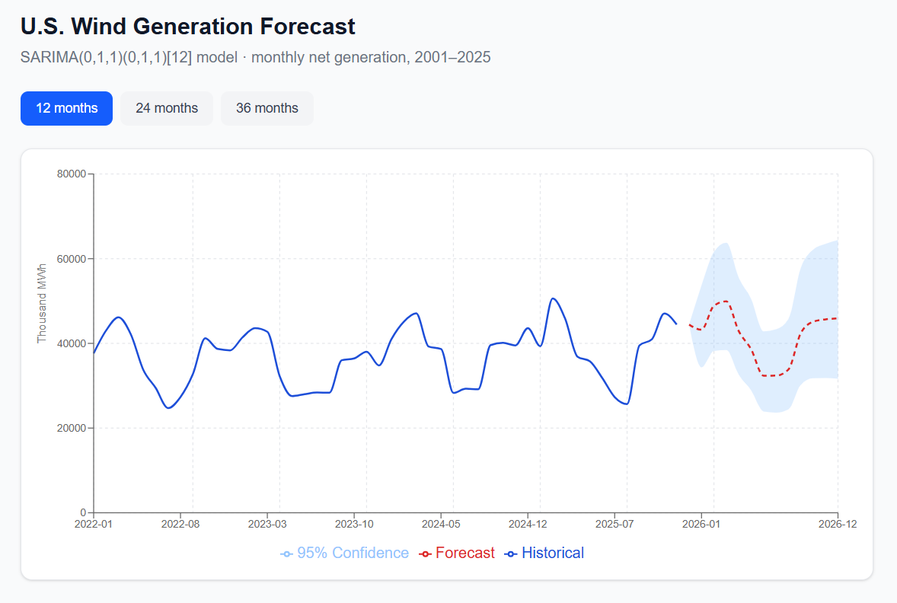

# U.S. Wind Energy Generation: Time Series Analysis & Forecasting

## Project Overview
This project analyzes and forecasts monthly net wind energy generation in the U.S. (thousand MWh) using data from the **U.S. Energy Information Administration (EIA)** spanning 2001 to 2025.

Using a rigorous three-phase methodology—**Identification, Estimation, and Forecasting**—this project successfully models the exponential growth and inherent seasonality of renewable energy production.

What started as a research notebook has since been extended into a full-stack web application — a FastAPI backend serves the trained model, and a Next.js dashboard lets users interactively explore historical generation and forecasts.



## Live Application

### Tech Stack

| Layer | Tech |
|---|---|
| Frontend | Next.js (React, TypeScript), Tailwind CSS, Recharts |
| Backend | FastAPI (Python) |
| Modeling | statsmodels (SARIMAX) — ported from the original R `arima()` model |
| Data | U.S. Energy Information Administration (EIA), monthly, 2001–2025 |

### Architecture

The application is split into three parts that communicate over HTTP.

The **Next.js frontend** is what the user sees in the browser: a chart of historical and forecasted wind generation, and a control to choose the forecast horizon. When the user loads the page or changes the horizon, the frontend sends a request to the backend and asks for data.

The **FastAPI backend** receives that request through two endpoints — `/history`, which returns the historical monthly generation values, and `/predict`, which returns a forecast for a given number of months. The backend doesn't store any logic about how to forecast on its own; it loads a pre-trained model and asks it to produce predictions, then returns those predictions to the frontend as JSON.

The **SARIMA model** (saved as `wind_model.pkl`) is the actual forecasting logic — the same SARIMA(0,1,1)(0,1,1)[12] model selected and validated in the R analysis below, re-implemented in Python. It is trained once, ahead of time, by a separate script (`train_model.py`), and the backend simply loads the saved result rather than retraining on every request.

So the flow for a single forecast request is: the frontend asks the backend for a prediction, the backend asks the saved model for a prediction, and the result travels back the same path to be drawn on the chart.

### Running Locally

**Backend:**
```bash
cd wind-forecast-backend
pip install -r requirements.txt
python train_model.py   # fits and saves the model (run once)
uvicorn main:app --reload
```

**Frontend:**
```bash
cd wind-forecast-frontend
npm install
npm run dev
```
Then open `http://localhost:3000`.

### From R to Python

The original analysis was built in R using `arima()`. For the web app, the
same model — SARIMA(0,1,1)(0,1,1)[12] — was re-implemented in Python with
`statsmodels.SARIMAX`, validated against the same 2025 holdout set used in
the R analysis: **MAPE of 10.16%** in Python vs. **10.53%** in R, confirming
the port preserves the original model's accuracy (the small difference
comes from minor optimizer differences between the two libraries' MLE
implementations, not a methodological change).

## Technical Methodology
I implemented a **SARIMA** (Seasonal Auto-Regressive Integrated Moving Average) approach to handle the non-stationary nature of the energy data:
* **Preprocessing:** Log transformation and differencing to stabilize variance and remove trends.
* **Model Selection:** A **SARIMA(0,1,1)(0,1,1)[12]** model was selected based on the Bayesian Information Criterion (BIC).
* **Validation:** Residual diagnostics confirmed white noise behavior, and the model achieved a **MAPE (Mean Absolute Percentage Error) of 10.53%**.

## Key Insights
* **Seasonal Peaks:** Analysis reveals that wind generation consistently peaks in **February, March, and April**, with a significant drop during summer months.
* **Growth Trends:** The model captures the dramatic shift in the U.S. energy landscape over the last two decades.
* **Forecasting:** Includes a 24-month ahead forecast for grid stability and investment planning insights.

## Repository Structure
* `wind_energy_analysis.ipynb`: Full R implementation including data visualization and SARIMA modeling.
* `Net_generation_wind_all_sectors_monthly.csv`: The primary dataset (2001–2025).
* `wind-forecast-backend/`: FastAPI backend serving the Python-ported SARIMA model.
* `wind-forecast-frontend/`: Next.js dashboard for interactive forecasting.
* `README.md`: Project documentation.
* `screenshot.png`: Dashboard screenshot.